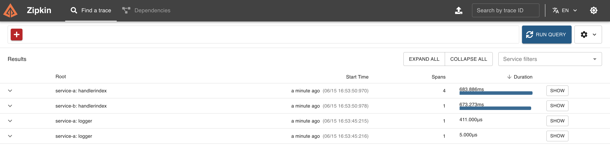
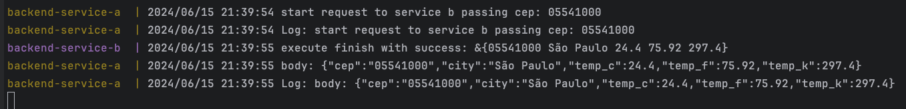

# Go Weather by CEP - Otel

### Tecnologies used

- Go
- Docker
- docker-compose
- Open Telemetry
- Zipkin

# Evidences

### Log Active

Service A talking with Service B using HTTP

## How to use

create `.env` and set you `WEATHER_API_KEY`

Get API KEY in https://www.weatherapi.com/my/

## External API Endpoins used

To get Cep and details
- [ViaCEP](https://viacep.com.br/)

To get Weather and details
- [WeatherAPI](https://www.weatherapi.com/)

## Temperature conversion

To convert Celsius to Fahrenheit
- F = C * 1,8 + 32

To convert Celsius to Kelvin
- K = C + 273

## Requirements

- Go 1.16
- Docker

## Details about changellenge

*Objetivo:* Desenvolver um sistema em Go que receba um CEP, identifica a cidade e retorna o clima atual (temperatura em graus celsius, fahrenheit e kelvin). Esse sistema deverá ser publicado no Google Cloud Run.

#### Requisitos:

O sistema deve receber um CEP válido de 8 digitos
O sistema deve realizar a pesquisa do CEP e encontrar o nome da localização, a partir disso, deverá retornar as temperaturas e formata-lás em: Celsius, Fahrenheit, Kelvin.
O sistema deve responder adequadamente nos seguintes cenários:

*Em caso de sucesso:*
Código HTTP: 200
Response Body: { "temp_C": 28.5, "temp_F": 28.5, "temp_K": 28.5 }
Em caso de falha, caso o CEP não seja válido (com formato correto):
Código HTTP: 422
Mensagem: invalid zipcode
​​​Em caso de falha, caso o CEP não seja encontrado:
Código HTTP: 404
Mensagem: can not find zipcode
Deverá ser realizado o deploy no Google Cloud Run.
Dicas:

#### API to use

Utilize a API viaCEP (ou similar) para encontrar a localização que deseja consultar a temperatura: https://viacep.com.br/
Utilize a API WeatherAPI (ou similar) para consultar as temperaturas desejadas: https://www.weatherapi.com/

#### Conversion

Para realizar a conversão de Celsius para Fahrenheit, utilize a seguinte fórmula: F = C * 1,8 + 32
Para realizar a conversão de Celsius para Kelvin, utilize a seguinte fórmula: K = C + 273
Sendo F = Fahrenheit
Sendo C = Celsius
Sendo K = Kelvin
Entrega:

#### To deliver
O código-fonte completo da implementação.
Testes automatizados demonstrando o funcionamento.
Utilize docker/docker-compose para que possamos realizar os testes de sua aplicação.
Deploy realizado no Google Cloud Run (free tier) e endereço ativo para ser acessado.
