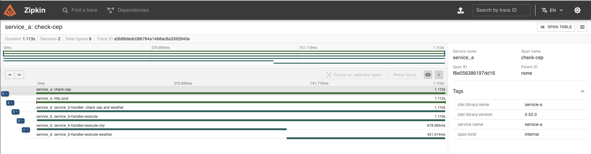

# Go Weather by CEP - Otel

## Tecnologias Utilizadas

- Go
- Docker
- docker-compose
- Open Telemetry
- Zipkin

## Evidências

### Tracing com Zipkin

Cadeia de eventos amarrados por contexto do Header

Adicionado o spanCity.End para o inicio do novo spanWeather.  
Obrigado @Gabriel Araujo Carneiro Junior, pelo toque, ajudou a entender a estrutura.

### Logs de Transações

Service A comunicando-se com Service B via HTTP

## Como Usar

1. Crie um arquivo `.env` e configure sua `WEATHER_API_KEY`.
2. Se encontrar problemas ao executar `go test ./...` no serviço de clima, verifique o `.env` com o comando `cat`.
    - Se houver um `%` no final do arquivo, remova-o.

Obtenha a API KEY em [WeatherAPI](https://www.weatherapi.com/my/).

## Endpoints de APIs Externas Utilizadas

### Para Obter CEP e Detalhes
- [ViaCEP](https://viacep.com.br/)

### Para Obter Clima e Detalhes
- [WeatherAPI](https://www.weatherapi.com/)

## Conversão de Temperatura

### Celsius para Fahrenheit
- Fórmula: `F = C * 1,8 + 32`

### Celsius para Kelvin
- Fórmula: `K = C + 273`

## Requisitos

- Go 1.16
- Docker

## Detalhes sobre o Desafio

### Objetivo

Desenvolver um sistema em Go que receba um CEP, identifique a cidade e retorne o clima atual (temperatura em graus Celsius, Fahrenheit e Kelvin) juntamente com o nome da cidade. Esse sistema deve implementar OTEL (Open Telemetry) e Zipkin.

### Serviço A

#### Requisitos - Serviço A (Responsável pelo Input)

1. O sistema deve receber um input de 8 dígitos via POST, utilizando o esquema: `{ "cep": "29902555" }`.
2. O sistema deve validar se o input é válido (contém 8 dígitos e é uma STRING).
3. Caso seja válido, o CEP deve ser encaminhado para o Serviço B via HTTP.
4. Caso não seja válido, deve retornar:
    - Código HTTP: 422
    - Mensagem: "invalid zipcode"

### Serviço B

#### Requisitos - Serviço B (Responsável pela Orquestração)

1. O sistema deve receber um CEP válido de 8 dígitos.
2. O sistema deve realizar a pesquisa do CEP e encontrar o nome da localização. A partir disso, deve retornar as temperaturas formatadas em Celsius, Fahrenheit, Kelvin juntamente com o nome da localização.
3. O sistema deve responder adequadamente nos seguintes cenários:

##### Em caso de sucesso:

- Código HTTP: 200
- Corpo da Resposta: `{ "city": "São Paulo", "temp_C": 28.5, "temp_F": 83.3, "temp_K": 301.5 }`

##### Em caso de falha, se o CEP não for válido (com formato correto):

- Código HTTP: 422
- Mensagem: "invalid zipcode"

##### Em caso de falha, se o CEP não for encontrado:

- Código HTTP: 404
- Mensagem: "cannot find zipcode"

### OTEL + Zipkin

#### Implementação:

1. Implementar tracing distribuído entre Serviço A e Serviço B.
2. Utilizar spans para medir o tempo de resposta do serviço de busca de CEP e busca de temperatura.

### Dicas:

1. Utilize a API ViaCEP (ou similar) para encontrar a localização: [ViaCEP](https://viacep.com.br/).
2. Utilize a API WeatherAPI (ou similar) para consultar as temperaturas: [WeatherAPI](https://www.weatherapi.com/).

#### Fórmulas para Conversão:

- Celsius para Fahrenheit: `F = C * 1,8 + 32`
- Celsius para Kelvin: `K = C + 273`

Sendo:
- F = Fahrenheit
- C = Celsius
- K = Kelvin

#### Links Úteis:

- [Implementação do OTEL](https://opentelemetry.io/docs/)
- [Implementação de Spans](https://opentelemetry.io/docs/instrumentation/)
- [Serviço de Collector do OTEL](https://opentelemetry.io/docs/collector/)
- [Informações sobre Zipkin](https://zipkin.io/)

### Entrega

1. Código-fonte completo da implementação.
2. Documentação explicando como rodar o projeto em ambiente de desenvolvimento.
3. Utilize Docker/docker-compose para que possamos realizar os testes da aplicação.
